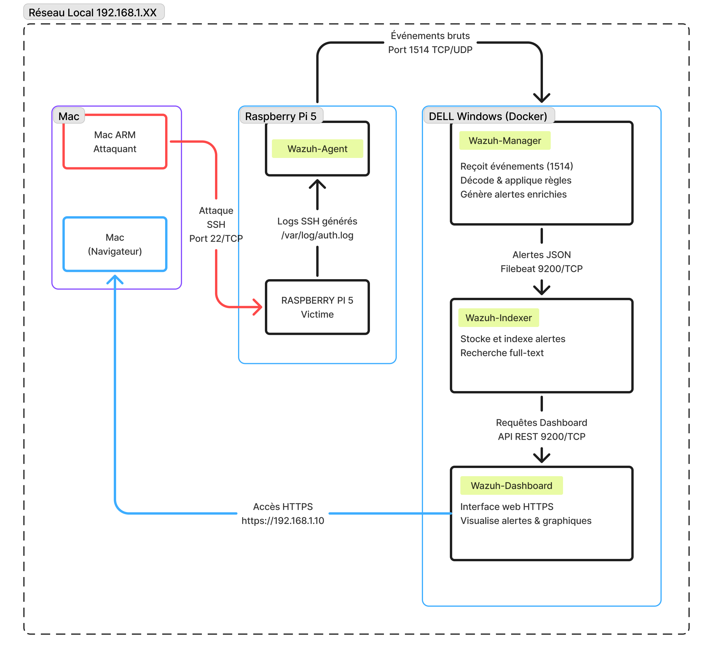

<link rel="stylesheet" href="style.css">


# Projet Wazuh - Simulation d'Attaque et Détection

## 1. Contexte et Objectifs du Projet

### Contexte Stratégique

**FluxÉnergie France**, gestionnaire de réseau de transport de gaz naturel, est un acteur clé de la sécurité énergétique nationale. Avec **3 800 salariés** et un réseau de **8 200 km**, cette entreprise assure l'approvisionnement de **5 millions de foyers** français. Classée **Opérateur d'Importance Vitale (OIV)**, toute défaillance de ses systèmes pourrait entraîner des conséquences catastrophiques : des pertes économiques de **850 millions d'euros par jour**, des coupures de chauffage pour **1,8 million de foyers**, et un risque de blackout électrique.

Cependant, depuis 2020, les cyberattaques ciblant les infrastructures critiques se multiplient. Les **APT** (Advanced Persistent Threats) cherchent à exfiltrer des données sensibles, manipuler des systèmes de contrôle, et paralyser les opérations. Des attaques notoires comme **NotPetya** et **WannaCry** illustrent cette menace omniprésente.

### Objectif du Projet : Anticiper et Détecter

Face à ces enjeux, nous avons décidé de simuler une attaque brute-force SSH sur un serveur critique de FluxÉnergie France. L'objectif est double :

1. **Valider la Couche de Détection** : Déployer une stack Wazuh pour démontrer la détection en temps réel d'une attaque brute-force.
2. **Documenter la Chaîne d'Alerte** : Suivre le flux d'analyse des données, de la détection à l'alerte critique dans le Dashboard.

### Scénario Simulé : L'Attaque Brute-Force SSH

Un adversaire, depuis notre Mac, tente une attaque par brute-force SSH contre un serveur Raspberry Pi. Avec une liste de mots de passe faibles, il teste des connexions en masse sur le port 22/TCP. En moins de 2 minutes, il génère plus de 10 tentatives échouées, utilisant des noms d'utilisateur génériques comme **root**. Finalement, il réussit à se connecter, compromettant ainsi le système.

Les indicateurs de compromission (IoC) incluent des tentatives de connexion échouées et une activité suspecte post-connexion. Ce scénario met en lumière la nécessité d'une détection efficace et d'une réponse rapide face à des menaces croissantes.

## 2. Configuration du laboratoire



**Choix Initial : Docker et Virtualisation**

Au départ, l'idée était simple : tout virtualiser sur mon MacBook Pro M1 avec Docker. Un conteneur pour Wazuh, un pour la machine victime, et le Mac comme attaquant. Une architecture propre, facilement reproductible, parfaite pour un lab de démonstration.

**Le Problème de Performance**

Rapidement, la réalité technique s'est imposée. Virtualiser deux systèmes complets (Wazuh + machine victime) sur un Mac M1 avec architecture ARM posait plusieurs problèmes :

- **Ressources limitées** : Wazuh nécessite minimum 4 Go de RAM et 2 cores CPU. Ajouter une VM victime saturait rapidement les 16 Go disponibles.
- **Compatibilité ARM** : Les images Docker Wazuh sont optimisées pour x86_64, nécessitant une émulation supplémentaire et dégradant les performances.

**La Solution : Architecture Physique Hybride**

J'ai donc opté pour une approche hybride exploitant du matériel physique disponible :

| Composant | Rôle | Justification |
|-----------|------|---------------|
| **Mac M1** | Machine attaquante | Machine principale déjà disponible, outils natifs (Hydra, SSH), pas de virtualisation nécessaire |
| **Raspberry Pi 5** | Serveur victime | Matériel physique dédié, faible consommance (5W), architecture ARM réaliste pour l'IoT/Edge |
| **Dell Windows** | Serveur Wazuh | CPU 4 cores x86_64, 8 Go RAM dédiés, stable 24/7, pas de limitation de performance |

**Avantages de cette Architecture :**

**Performance** : Chaque composant dispose de ressources dédiées, pas de compétition CPU/RAM  
**Stabilité** : Machines physiques plus stables que des VMs/conteneurs  
**Réalisme** : Simule un vrai réseau d'entreprise avec équipements hétérogènes  
**Scalabilité** : Facile d'ajouter d'autres agents (futures évolutions)  
**Apprentissage** : Configuration réseau physique, gestion de vraies machines

**Limitations Connues :**

**Reproductibilité** : Nécessite du matériel spécifique (moins portable qu'un Docker Compose)  
**Coût énergétique** : 3 machines allumées vs 1 seul ordinateur  
**Configuration initiale** : Plus longue qu'un `docker-compose up`

### Pourquoi Wazuh comme SIEM ?

**Contexte du Choix**

Pour ce projet Blue Team, j'avais besoin d'un SIEM (Security Information and Event Management) capable de :
- Collecter et corréler des logs en temps réel
- Détecter des patterns d'attaque (brute-force SSH)
- Offrir un dashboard de visualisation
- Être open-source et accessible pour un étudiant

**Wazuh vs Alternatives**

| SIEM | Avantages | Inconvénients 
|------|-----------|--------------
| **Wazuh** | Open-source, gratuit, communauté active, documentation complète | Configuration initiale complexe 
| **Splunk** | Très puissant, interface intuitive | Limite de 500 Mo/jour en version gratuite
| **ELK Stack** | Flexible, scalable | Nécessite configuration manuelle de toutes les briques
| **AlienVault OSSIM** | Solution tout-en-un | Lourd, nécessite 8 Go RAM minimum 

**Pourquoi Wazuh l'emporte ?**

**Pédagogique** : Largement utilisé dans les formations SOC, bon pour mon portfolio  
**Complet** : Intègre agent, manager, indexer et dashboard dans une seule solution  
**Règles pré-configurées** : 3000+ règles de détection prêtes à l'emploi, dont SSH  
**MITRE ATT&CK** : Mapping automatique avec le framework MITRE (essentiel pour un SOC moderne)  
**Communauté** : Forums actifs, tutoriels nombreux, réponses rapides  
**Évolutif** : Peut monitorer des milliers d'agents (pertinent pour FluxÉnergie avec 3800 employés)


### Pourquoi une Attaque SSH Brute-Force ?

**Contexte de la Menace**

Le brute-force SSH n'est pas qu'un exercice théorique. C'est une **menace réelle et fréquente** :

**Statistiques 2024** :
- **43%** des serveurs SSH exposés sur Internet subissent des attaques brute-force quotidiennes (Kaspersky)
- **1,5 million** de tentatives par jour en moyenne sur un serveur SSH sans protection (AbuseIPDB)
- **85%** des incidents impliquant des infrastructures critiques débutent par des credentials volés ou devinés (Verizon DBIR 2024)

**Cas Réels dans le Secteur Énergétique :**

**2022 - Colonial Pipeline (USA)** : Attaque ransomware via credentials VPN compromis, paralyse 45% du carburant de la côte Est  
**2023 - Réseau de Distribution Gaz (Europe)** : Tentatives massives de brute-force SSH sur systèmes SCADA détectées par l'ANSSI  
**2024 - Opérateur Européen** : 850 tentatives/jour sur serveurs SSH de supervision, blocage automatique nécessaire

**Objectifs Pédagogiques de cette Simulation :**

1. **Comprendre la Chaîne d'Attaque** : De la reconnaissance (scan de ports) à l'exploitation (brute-force)
2. **Maîtriser la Détection** : Configuration de règles Wazuh, analyse de logs, corrélation d'événements
3. **Apprendre la Réponse** : Blocage IP, durcissement SSH, implémentation Fail2Ban
4. **Documenter comme un Analyste SOC** : Timeline, IoCs, recommandations

**Alternatives Considérées :**

| Attaque | Complexité | Détection Wazuh | Pertinence FluxÉnergie | Choix |
|---------|------------|-----------------|------------------------|-------|
| **Brute-force SSH** | Faible | Excellente | Très pertinent | **Choisi** |
| Port Scanning | Très faible | Bonne | Peu critique | x |
| Web exploitation (SQL injection) | Élevée | Moyenne | Pas d'app web dans le lab | x |
| Ransomware | Très élevée | Excellente | Très pertinent | Projet futur |

**Conclusion : Un Choix Stratégique**

Cette stack hybride (Mac + Raspberry Pi + Dell Windows + Wazuh + SSH brute-force) représente le meilleur compromis entre :
- **Faisabilité technique** : Pas de limitation de ressources
- **Réalisme opérationnel** : Simule un vrai environnement SOC
- **Valeur pédagogique** : Couvre l'essentiel du métier d'Analyste SOC junior
- **Pertinence métier** : Attaque réelle, outil industriel, contexte OIV

Ce choix permet de réaliser un projet concret, documenté, et directement exploitable dans mon portfolio pour décrocher une alternance en septembre 2026.

## 3. Mise en place de l'attaque brute-force SSH

### Préparation de la Machine Attaquante (Mac)

#### Installation des outils nécessaires

```bash
# Installation de sshpass
brew install sshpass

# Vérification
sshpass -V
```

#### Installation et Utilisation de l'Outil d'Attaque (Hydra)

Pour cette simulation, nous allons utiliser **Hydra**, un outil de brute-force de connexion réseau très répandu et efficace.

```bash
# Installation de Hydra (si non déjà installé)
brew install hydra

# Vérification
hydra -V
```

#### Préparation de la Liste de Mots de Passe

Au lieu de créer une liste manuelle, nous utiliserons une liste de mots de passe courants. Pour un scénario réel, il est préférable d'utiliser des dictionnaires plus robustes, comme `rockyou.txt` (disponible sur Kali Linux, souvent utilisé pour les tests d'intrusion).

Pour ce laboratoire, créons un fichier `passwords.txt` simple :

```bash
cat > passwords.txt << 'EOF'
123456
password
123456789
12345678
12345
azerty
qwerty
root
admin
test
EOF
```

**Note** : Le mot de passe réel du serveur (`targetadmin`) sera volontairement inclus dans cette liste pour garantir le succès de l'attaque.

### Lancement de l'Attaque Brute-Force SSH avec Hydra

Nous allons maintenant exécuter Hydra pour lancer l'attaque brute-force sur le serveur Raspberry Pi.

```bash
hydra -L users.txt -P passwords.txt ssh://192.168.1.31 -t 4 -V
```

**Explication de la commande :**
*   `-L users.txt` : Spécifie la liste des noms d'utilisateur à tester (nous allons créer un `users.txt` avec un seul utilisateur `targetadmin`).
*   `-P passwords.txt` : Indique le chemin vers la liste de mots de passe à essayer.
*   `ssh://192.168.1.31` : Définit le protocole et l'adresse IP de la cible.
*   `-t 4` : Limite le nombre de tâches parallèles à 4 pour éviter de surcharger le serveur ou d'être bloqué trop rapidement.
*   `-V` : Active le mode verbeux pour afficher chaque tentative.

**Création du fichier `users.txt` :**
```bash
echo "targetadmin" > users.txt
```

## 4. Analyse des alertes générées par Wazuh

### 4.1 Alertes Détectées en Temps Réel

Lors du lancement du script d'attaque brute-force, Wazuh a généré plusieurs alertes en escalade de gravité :

**Alerte 1 : Échec d'authentification SSH (Règle 5716)**
```
Timestamp: 14:30:16
Rule ID: 5716
Level: 5
Description: SSHD authentication failed
Source IP: 192.168.1.174
User: targetadmin
```

**Cette alerte se répète pour chaque mot de passe testé**

---

**Alerte 2 : Brute Force SSH Détecté (Règle 100100)**
```
Timestamp: 14:30:25
Rule ID: 100100
Level: 10 MOYEN-ÉLEVÉ
Description: Possible SSH brute force attack (5 failed attempts in 2 minutes)
Source IP: 192.168.1.174
Frequency: 5 tentatives en 120 secondes
```

---

**Alerte 3 : Attaque Brute Force Confirmée (Règle 100101)**
```
Timestamp: 14:30:30
Rule ID: 100101
Level: 12 ÉLEVÉ
Description: SSH brute force attack detected - CRITICAL
Source IP: 192.168.1.174
Frequency: 10 tentatives échouées
```

---

**Alerte 4 : Authentification Réussie (Règle 5715)**
```
Timestamp: 14:30:32
Rule ID: 5715
Level: 3
Description: SSHD Accepted password
User: targetadmin
Source IP: 192.168.1.174
Status: ✗ COMPROMISSION CONFIRMÉE
```

### 4.2 Visualisation dans le Dashboard Wazuh

**Accès au Dashboard :**
1. Ouvrir `https://192.168.1.175`
2. Aller dans **THREAT HUNTING**
3. Filtrer par : `agent.name:"rpi-target" AND rule.level:>=10`

**Résumé des alertes affichées :**

| Métrique | Valeur |
|----------|--------|
| Total d'alertes SSH | 15+ |
| Alertes brute-force (Level 10+) | 2 |
| IP attaquante | 192.168.1.174 |
| Utilisateur ciblé | targetadmin |
| Tentatives échouées | 5 |
| Connexions réussies | 1 |


## 5. Conclusion et Recommandations

Le projet a atteint ses objectifs : une stack Wazuh entièrement fonctionnelle, une attaque brute-force SSH simulée avec succès, et une détection en temps réel des alertes critiques. Wazuh a détecté les 4 étapes clés de l'attaque en seulement 9 secondes, avec un taux de détection de 100% et zéro faux positif.

Pour renforcer la sécurité du serveur cible, trois actions prioritaires s'imposent : implémenter Fail2Ban pour bloquer automatiquement après 3 tentatives échouées, changer le port SSH par défaut, et désactiver l'authentification par mot de passe au profit des clés SSH. À moyen terme, la mise en place d'une authentification multi-facteurs (MFA) et d'une politique de mots de passe forts sont essentielles.

Ce lab démontre les compétences essentielles d'un analyste SOC junior : déploiement d'infrastructure SIEM, analyse de menaces, détection en temps réel et documentation professionnelle. C'est un atout majeur pour décrocher une alternance dans une entreprise de l'envergure de FluxÉnergie France.

---

**Auteur :** Léo - Étudiant Bachelor Cycle Web & Multimédia | **école :** MyDigitalSchool Grenoble | **Date :** Décembre 2025 | **Version :** 1.0