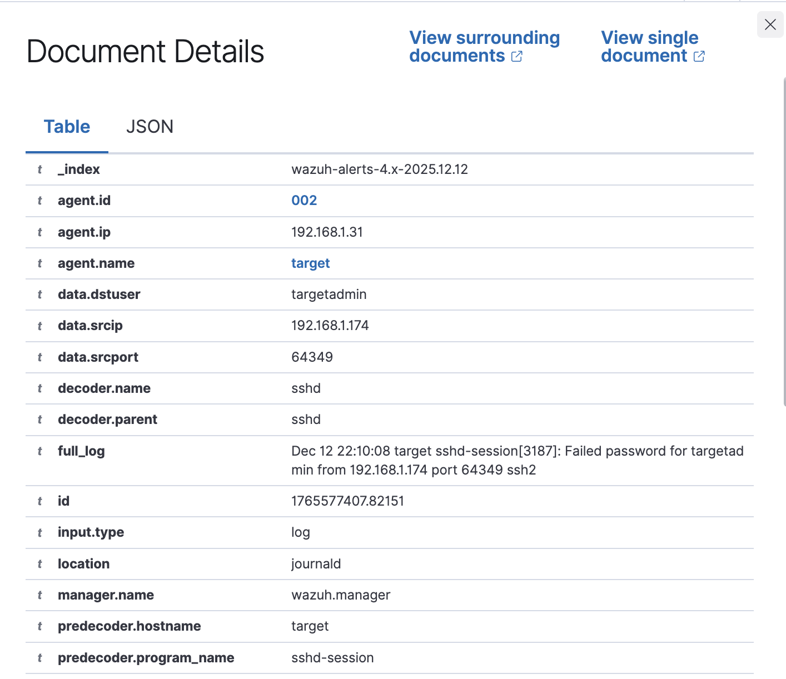
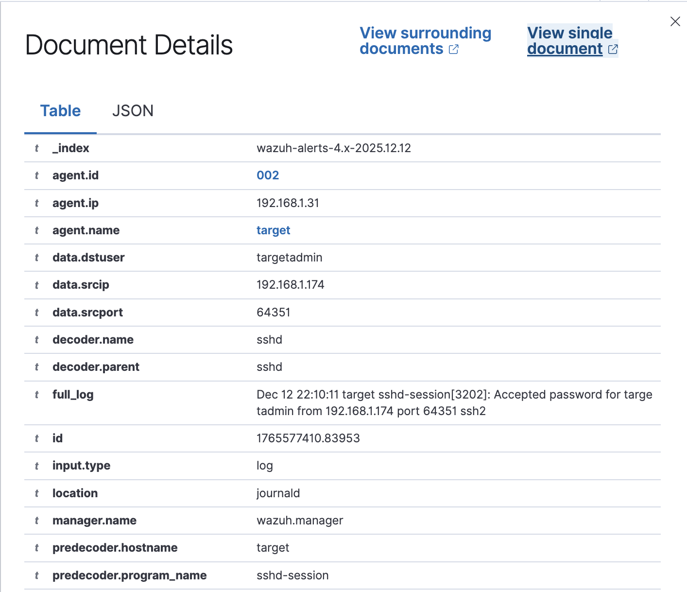

<link rel="stylesheet" href="style.css">

# Rapport d'Incident de Sécurité

## Informations Générales

**Analyste:** Léo Analyste Junior  
**Date de détection:** 13 décembre 2025  
**Date du rapport:** 13 décembre 2025  
**Niveau de sévérité:** ÉLEVÉ  
**Statut:** Compromis confirmé

---

## Résumé Exécutif

Une attaque de type brute force SSH a été détectée et analysée via la plateforme Wazuh. L'attaquant a effectué 48 tentatives d'authentification échouées suivies d'au moins une authentification réussie, compromettant ainsi l'accès au système cible.

---

## Détails Techniques de l'Incident

### 1. Chronologie de l'attaque

**Période d'activité:** 12 décembre 2025, entre 22:43 et 23:10  
**Durée totale:** Approximativement 27 minutes

**Phases identifiées:**
- **Phase 1 (22:43 - 22:48):** Tentatives massives d'authentification échouées sur le compte "root"
- **Phase 2 (22:48 - 23:09):** Tentatives d'authentification sur le compte "targetadmin"
- **Phase 3 (23:10):** Compromission réussie du compte "targetadmin"

### 2. Indicateurs Techniques

| Paramètre | Valeur |
|-----------|--------|
| **IP Source** | 192.168.1.174 |
| **IP Cible** | 192.168.1.31 |
| **Hôte Cible** | target (Agent ID: 002) |
| **Port de service** | 22 (SSH) |
| **Protocole** | SSH2 |
| **Total d'événements** | 52 |

### 3. Détails des Événements

#### Tentatives d'authentification échouées
- **Nombre:** ~48 tentatives
- **Rule ID Wazuh:** 5760
- **Niveau de sévérité:** 5
- **Description:** "sshd: authentication failed"
- **Comptes ciblés:** 
  - root (première vague d'attaque)
  - targetadmin (deuxième vague d'attaque)

**Exemple de log:**

